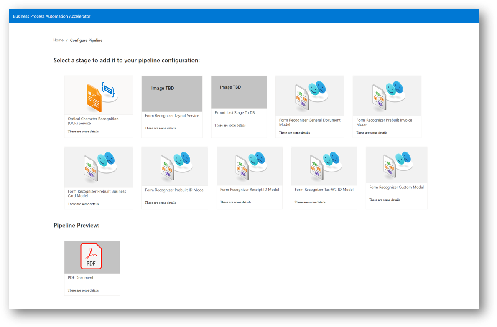
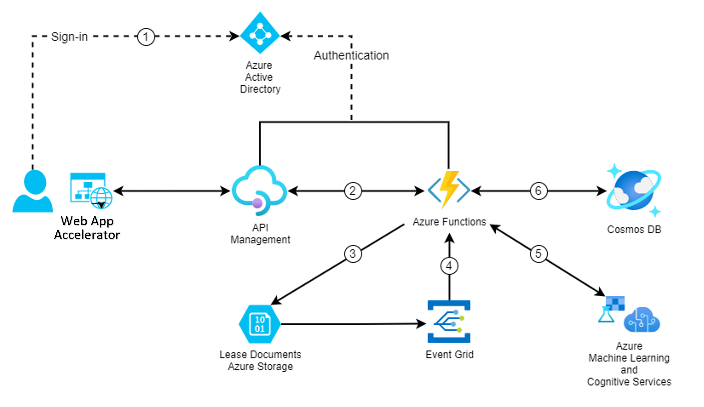
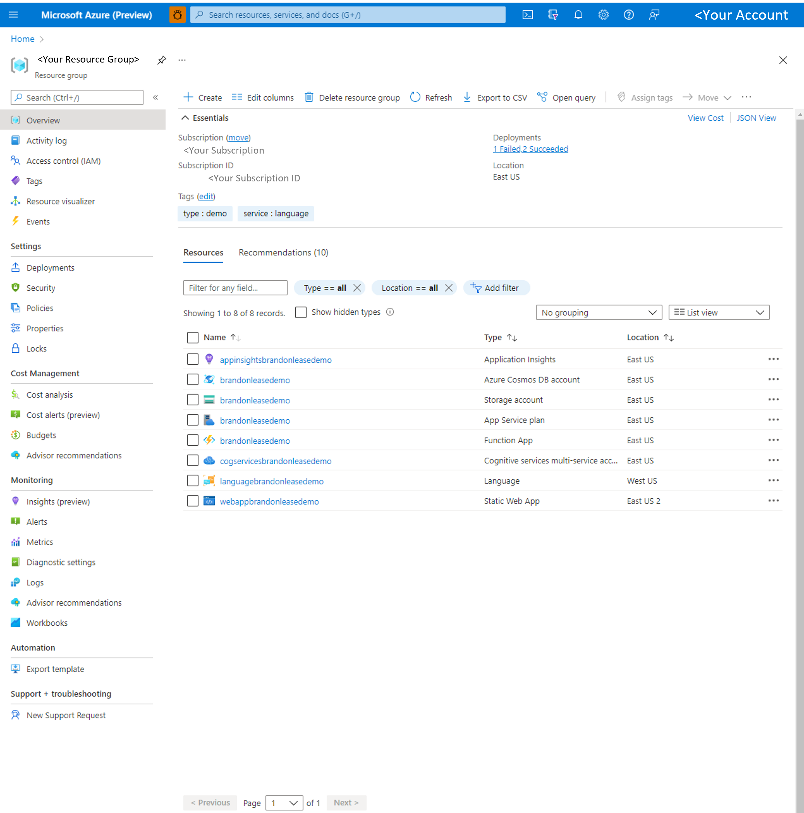

# Business Process Accelerator

## Overview

[Azure Static Web Apps](https://docs.microsoft.com/azure/static-web-apps/overview) allows you to easily build [React](https://reactjs.org/) apps in minutes. Use this repo with the [React quickstart](https://docs.microsoft.com/azure/static-web-apps/getting-started?tabs=react) to build and customize a new static site and automate the deployment of a functional, and customizable, POC for text and language processing. 

This repo will create, and manage, a set of cognitive services and app resources, and most of the individual resource crendentials in your newly created Resource Group. And provide a React UI for uploading documents, creating language and audio pipelines using a variety of user-specified Azure Cogntive Services, and exporting the results. 

The following guide will present a high-level overview of the deployment architecture, with step-by-step instructions for immediate deployment, with several simple command-line steps.

- [Overview](#overview)  
- [Architecture](#architecture)  
- [Currently Inluded Algorithms](#currently-inluded-algorithms)  
- [Prerequisities](#prerequisities)  
- [Installation Steps](#installation-steps)  
  - [Clone starter backend repo](#1-clone-the-starter-backend-repo)  
  - [Set Up Resource Group](#2-create-a-resource-group-in-your-azure-portal)  
  - [Set up Azure DevOps Pipeline](#3-setting-up-azure-devops-pipeline)  
    - [Navigate to Azure](#1-navigate-to-azure-devops-wwwdevazurecom)
    - [Create a New Project](#2-create-a-new-project)
    - [Select Repo](#3-select-repos-in-left-navigation-pane)  
    - [Import Repository](#4-select-import-a-repository)  
    - [Navigate to Project Settings](#5-navigate-to-project-settings)
    - [Create Service Connection](#6-create-service-connection)  
    - [Define Pipeline](#7-define-pipeline)  
    - [Clone UI Repo](#clone-ui-repo)
    - [Review your Pipeline YAML](#8--review-your-pipeline-yaml)  
- [Save and Run!](#save-and-run!)  
- [Launch App](#load-app)  
- [Load Documents!](#load-documents!)  
- [Contacts](#contacts)  
- [Roadmap](#roadmap)
- [References](#references)  
---

## Architecture
Once you've created a high-level Resource Group, you'll create a high-level Azure DevOps pipeline and import/clone this repo, automatically importing helper libraries and taking advantage of Azure functions to deploy the set of Azure Cognitive Services and manage all of the new Azure module credentials, in the background, within your newly created pipeline. Once the pipeline is deployed, a static webapp will be created with your newly customizable POC UI for document processing!

## Currently Included Algorithms
The initial release includes Cognitive Services provided by Azure Language Service and Form Recognizer, such as text classification and custom named entity recognition, as well as standardized interface for deploying State-of-the-Art Hugging Face models. Additional tasks and models are on the roadmap for inclusion (see Roadmap section later in this document).
#### Form Recognizer Models  

| Model | Description |
| ----- | ----------- |
|Read (preview)	| Extract printed and handwritten text lines, words, locations, and detected languages. |
| General document (preview) |	Extract text, tables, structure, key-value pairs, and named entities.|
| Layout |	Extract text and layout information from documents.|  

 Prebuilt  
| Model | Description |
| ----- | ----------- |
| W-2 (preview) |	Extract employee, employer, wage information, etc. from US W-2 forms.|
|Invoice	| Extract key information from English and Spanish invoices.|
|Receipt	| Extract key information from English receipts.|
|ID document	| Extract key information from US driver licenses and international passports.|
|Business card	| Extract key information from English business cards.|  

Custom
| Model | Description |
| ----- | ----------- |
| Custom |	Extract data from forms and documents specific to your business. Custom models are trained for your distinct data and use cases. |
| Composed |	Compose a collection of custom models and assign them to a single model built from your form types.|  

https://docs.microsoft.com/en-us/azure/applied-ai-services/form-recognizer/concept-model-overview
#### Language Service Models

#### Hugging Face Implementation

## Prerequisities
1. Github account
2. Ensure your subscription has Microsoft.DocumentDB enabled  
To check:  
    a. Go to your subscription within portal.azure.com  
    b. Select Resource Providers at bottom of left navigation pane  
    c. Within the Filter by name menu, search for Microsoft.DocumentDB  
    d. Once Microsoft.DocumentDB is found, check if the status is marked as "Registered". If marked as "NotRegistered", Select "Register"  
    **Note**:*This process may take several seconds/minutes, be sure to refresh the entire browser periodically*
3. Ensure that you have accepted terms and conditions for Responsible AI
 "You must create your first Face, Language service, or Computer Vision resources from the Azure portal to review and acknowledge the terms and conditions. You can do so here: Face, Language service, Computer Vision. After that, you can create subsequent resources using any deployment tool (SDK, CLI, or ARM template, etc) under the same Azure subscription."

## Installation Steps

### 1. Create a Resource Group in your Azure Portal
Create your Resource group.
Select your preferred Region

https://docs.microsoft.com/en-us/azure/azure-resource-manager/management/manage-resource-groups-portal

It will take a few seconds for your Resource Group to be created.

For more help, refer to https://docs.microsoft.com/en-us/azure/azure-resource-manager/management/manage-resource-groups-portal

### 2. Fork the repo
Fork https://github.com/jameshoff-msft/easyButton to your github account  

insert guidance and image here to fork

**Note**: *a Microsoft organization github account is **not** required*  

### 3. Create AND save personal access token
  i.   On your github repo page, click your profile  
  ii.  Select Settings  
  iii. Select Developer settings at bottom of left navigation pane  
  iv.  Select Personal access tokens  
  
  v.   Select Generate personal access token  
  
  vi.  Under Select scopes, select the checkbox for "workflow"
  
  i.  projectName = must be a unique project name, keep to lowercase, alphanumeric characters only
  ii. repository token: copy the personal access token you recently created
  iii. repository url: paste the link of your forked repository

  iii. commit your updates
  **Note**: This may take several minutes
  
### 5. clone your repo locally
### 6. Run initial deployment configuration  
  i. Open local command line window
  ii. Navigtate to <your local repository>/src/templates
  ii. Run az deployment group create --name ExampleDeployment --resource-group easybutton --template-file main.json --parameters parameters.json
  **Note**: This may take several seconds to run  

### 7. Create action to deploy
  i. Navigate to actions tab
  ii. Select create new workflow
  iii. Select set up workflow yourself
  iv. rename your the main.yml file (e.g. try "mainnew.yml") and select committ new file

 
 ## 5. Launch App
1. Navigate to your Resource Group within your Azure Portal <insert static web app screenshot here>
2. Select your static webapp
3. Within the default Overview pane, Select your URL to navigate to the WebApp, this take you to the newly launched WebApp!
 
 
 
 ## 6. Load Documents!
Use the Select PDF File to load your documents  
  **Note**: *your documents should be in pdf/image format. The first document loaded may take several minutes. However, all subsequent documents should be processed much faster*

Check for you newly found custom entities!
 
    
  
You can further customize your UI via the front end repo https://github.com/<your github account>/bpa-engine-frontend. Simple instructions on how to quickly do so are coming soon

## Contacts
 Please reach out to the AI Rangers for more info or feedback aka.ms/AIRangers

## Roadmap
| Priority | Item |
| ------- | ------------- |
| Impending | Adding instructions on basic UI customizations (e.g. Adding header graphics, changing title, etc..) |
| Impending | Add standard NER capability from Language Service [What is Named Entity Recognition (NER) in Azure Cognitive Service for Language](https://docs.microsoft.com/en-us/azure/cognitive-services/language-service/named-entity-recognition/overview#:~:text=Named%20Entity%20Recognition%20(NER)%20is,categorize%20entities%20in%20unstructured%20text.)  |
| TBD | Add text summarization |
| TBD | ... |
 

## References
| Subject | Source (Link) |
| ------- | ------------- |
| React source template | This project was bootstrapped with [Create React App](https://github.com/facebook/create-react-app) |
| Custom NER |  https://github.com/microsoft/nlp-recipes/tree/master/examples/named_entity_recognition |
| Text Classification | https://github.com/microsoft/nlp-recipes/tree/master/examples/text_classification |
